## Geek Bang
> 极客时间go语言入门到实战学习

#### 切片
1. 切片结构组成
    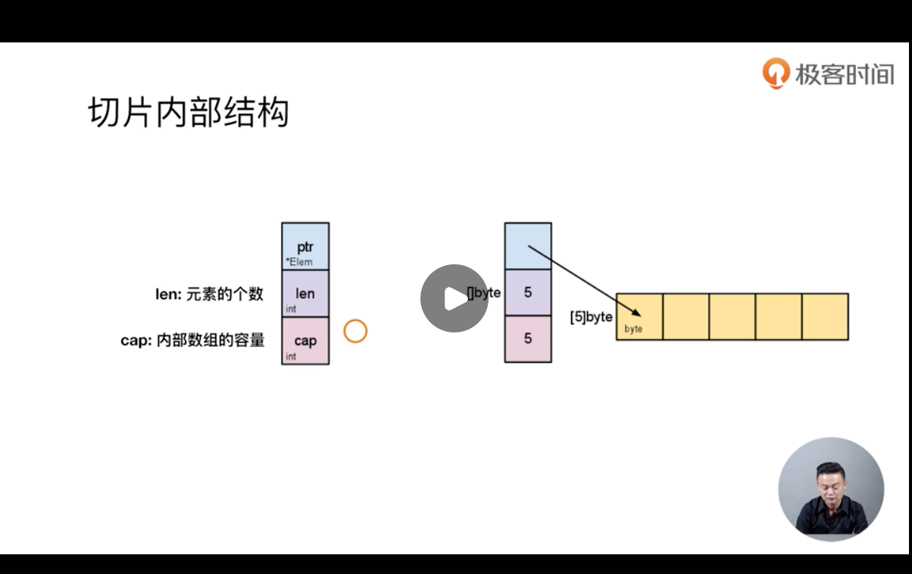
   
2. 切片共享内存原理
    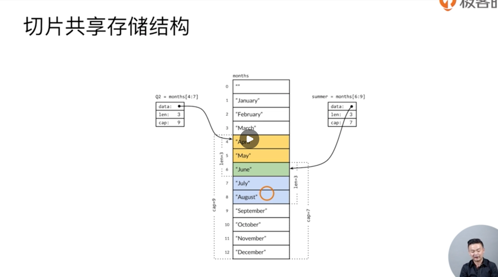
   
#### 字符
1. 字符本质是[]byte的数组，但是只读，所以不能通过修改数组的值来改变字符
2. len()会统计字符的byte长度
3. 遍历数组时会把每个字符存放到rune中，因为这样可以兼容utf8

#### 函数
1. 函数是一等公民
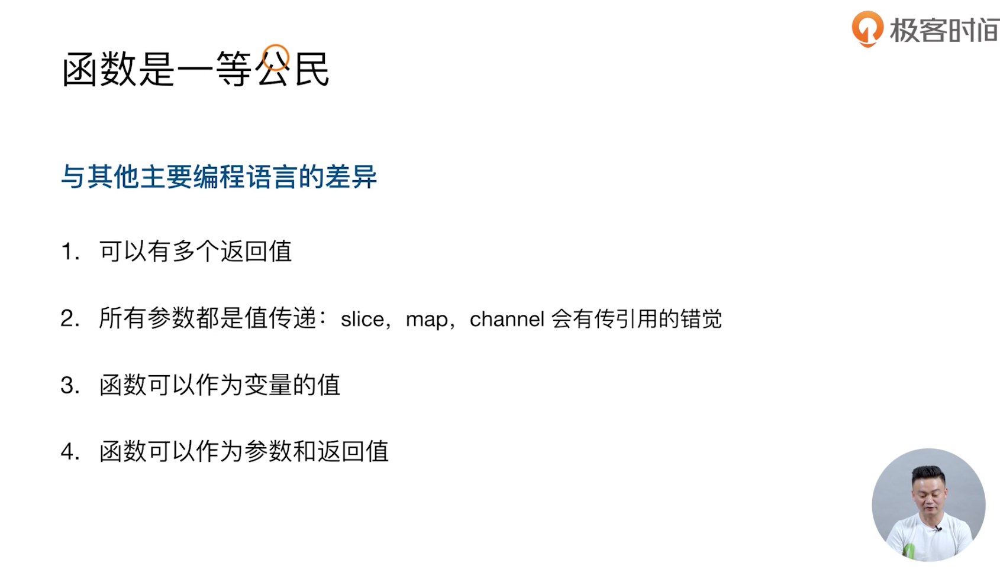

#### 面向对象
1. GO是一门面向对象编程语言？
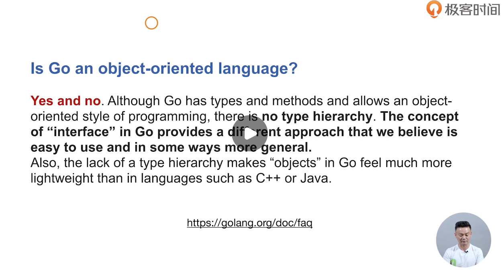

2. 接口的结构
    >注意：数据保存方式是一个地址
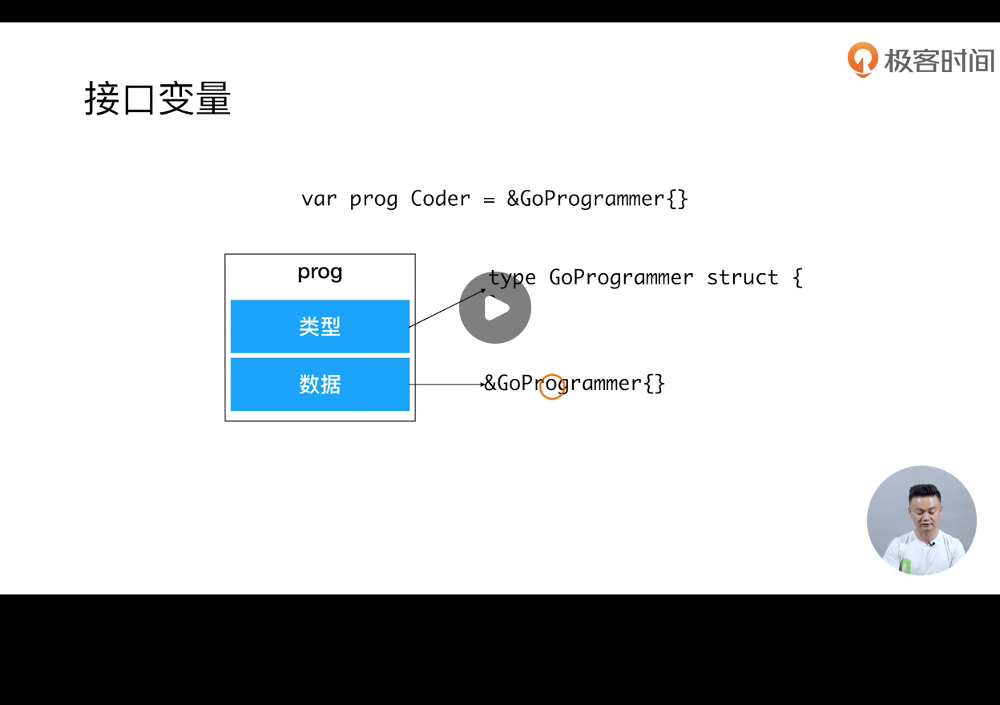
   
3. 接口使用的是Duck Type
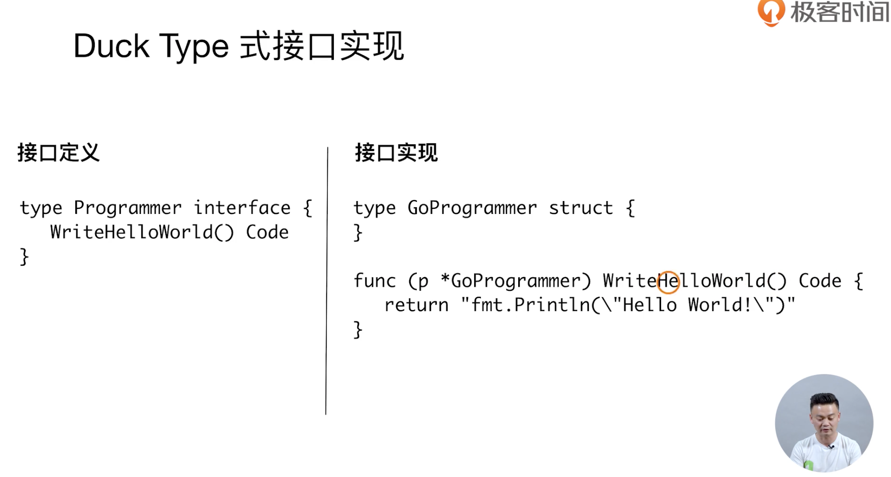

3. 接口最佳实践
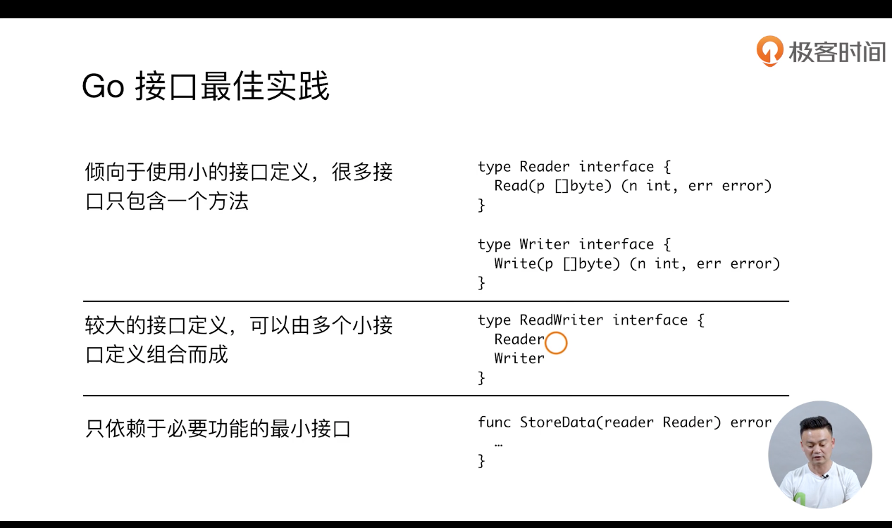
   1. 尽量试用小接口
   2. 使用小接口组合成大接口
   3. 只依赖必要功能的小接口
    
#### 错误机制
1. 要点
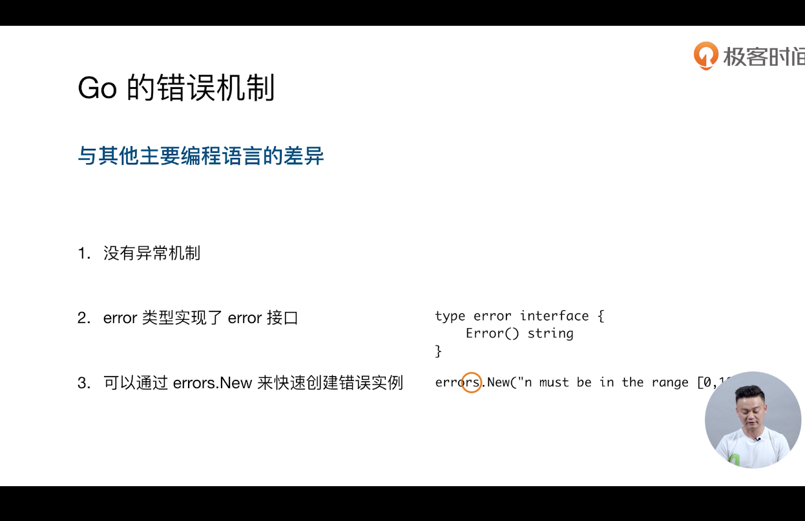
   
2. panic
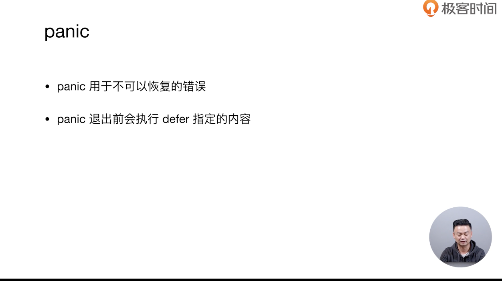
   
#### 包管理
1. package
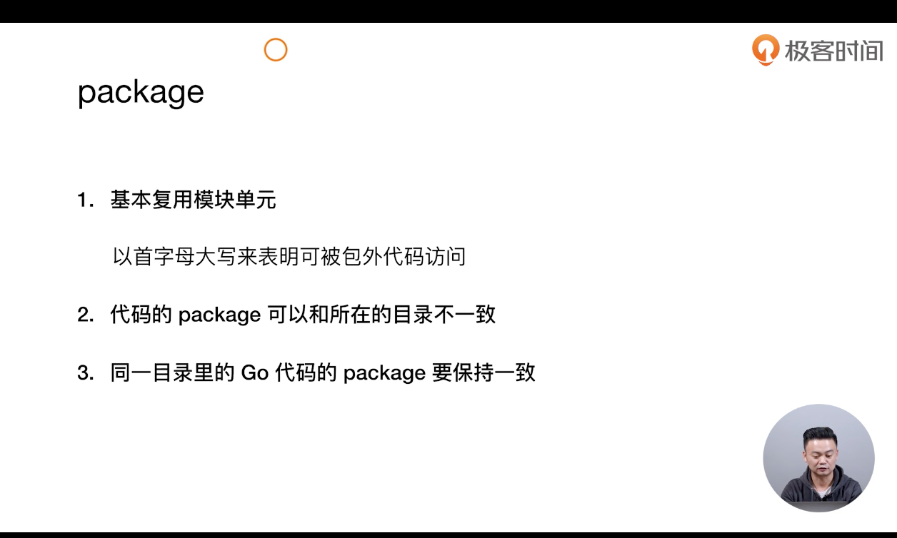
   
2. init函数
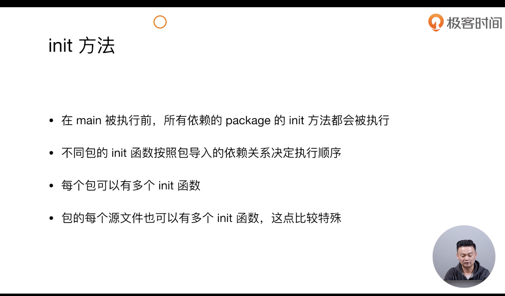
   
3. 获取远程package
```shell
go get ...
```

#### 并发编程
1. channel机制
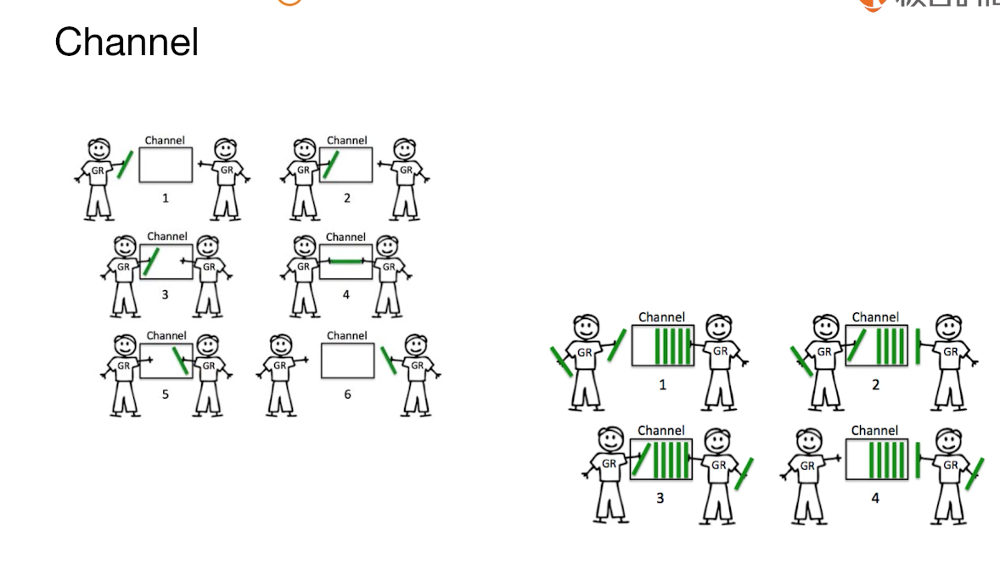